Linux
***********************

TVBox
=======================

A configuração da central de aquisição de dados do veículo envolve apagar o sistema operacional android
que vem instalado de fábrica na TVBox e substituí-lo por um sistema linux baseado em debian (Armbian). Existem
imagens pré-compiladas do Armbian para o modelo de TVBox da equipe, contudo a versão do kernel e da distribuição
nem sempre estão atualizadas, e a falta do módulo usbip-host na configuração usada pela equipe do Armbian para
montar as imagens requer a compilação do kernel de qualquer forma. Portanto, este tutorial busca documentar o processo
de compilação e instalação do novo sistema operacional no dispostivo.

.. note::
  Conheça o Armbian! https://www.armbian.com/

Identificando o modelo
++++++++++++++++++++++++++++++++

A TVBox atual da equipe é uma MXQ9 - 4K com um processador Quad Core ARM rk3229 da Rockchip, 
a versão da PCB é a TXCZ-RK3229-MXQ-V2.1 e a memória secundária é do tipo eMMC. Outros modelos
de TVBox com processadores diferentes, como o a905x da Amlogic, tem processos de instalação e compilação
muito semelhantes, e provavelmente é possível usar os passos aqui descritos para essas placas sem muitas
modificações. Caso não saiba exatamente o modelo da TVBox da equipe, basta conferir nas configurações do android
antes de apagar o sistema da memória.

Preparando o ambiente de desenvolvimento
++++++++++++++++++++++++++++++++++++++++++++++

Atualmente (Dezembro de 2021) o Armbian utiliza o Ubuntu 21.04 Hirsute Hippo como sistema operacional oficialmente suportado,
mas é bastante provável que esta não seja mais a última versão da distro quando você estiver lendo este tutorial. Apesar dessa recomendação
oficial, o sistema atualmente instalado na TVBox da equipe foi compilado sobre o Debian Unstable (última release foi a bullseye) sem 
nenhum problema, mas caso não tenha computador ou VM linux pronto use a versão 
recomendada para evitar erros. Confio no seu google-fu para encontrar onde baixar o ubuntu, e caso queira
conferir a versão recomendada basta buscar as instruções de compilação oficiais no site do Armbian.

Instalando o ubuntu
-----------------------------

Existem vários tutoriais na internet para instalação do ubuntu, escolha uma VM ou dual-boot e seja feliz. Caso nunca tenha instalado o linux 
antes, recomendo esse vídeo do Diolinux: https://www.youtube.com/watch?v=6D6L9Wml1oY. Se realmente não quiser instalar o linux, um dos computadores
da oficina está rodando alguma versão do kubuntu. 

Instalando pacotes e baixando a fonte
-------------------------------------------

É necessário ter cerca de 20 GB de espaço livre para realizar o processo, git e o build-essential instalado:
::

  sudo apt install git build-essential

Agora, basta clonar o repositório, entrar na pasta e executar o script:
::

  git clone --depth 1 https://github.com/armbian/build  
  cd build  
  ./compile.sh

O script irá perguntar se deseja compilar apenas o kernel ou a imagem inteira, escolha a imagem inteira:

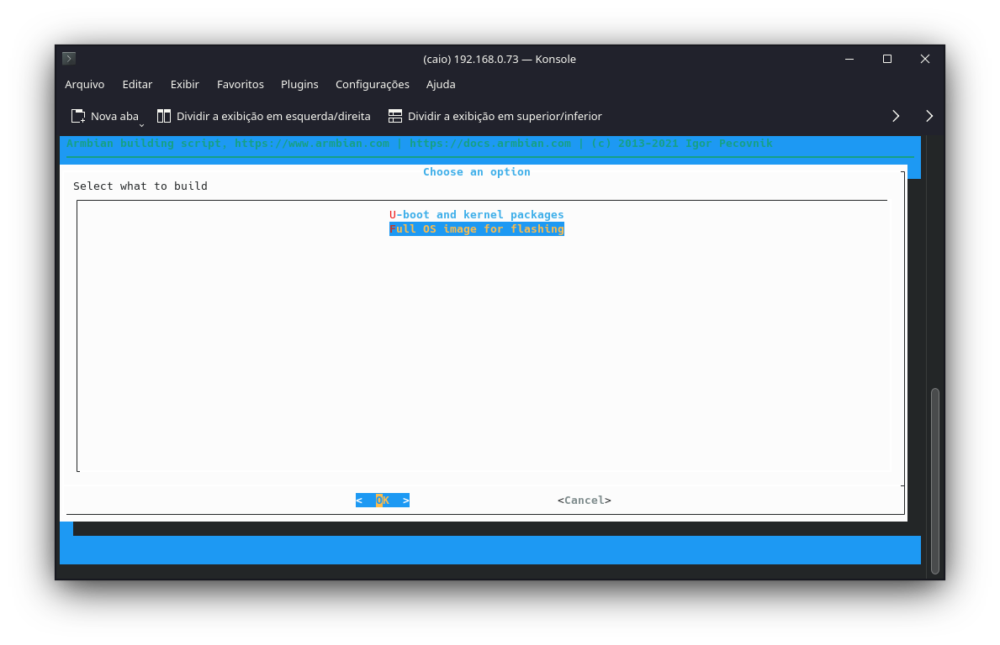

Escolha a opção para mostrar a janela de configuração do kernel antes da compilação:

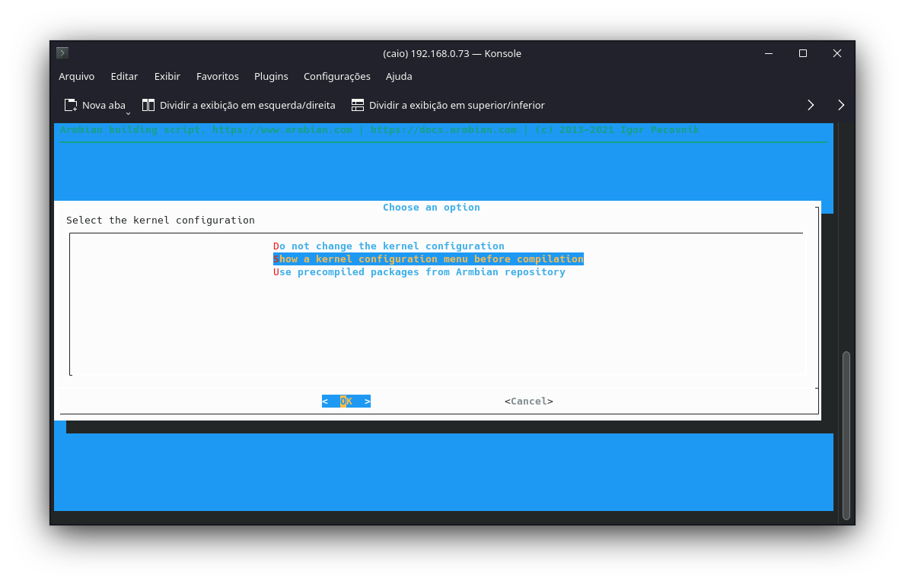

Agora devemos escolher o modelo correto da TVBox. Ela não estará listada na página principal dos dispositivos, escolha a opção "Show CSC/WIP/EOS/TVB":

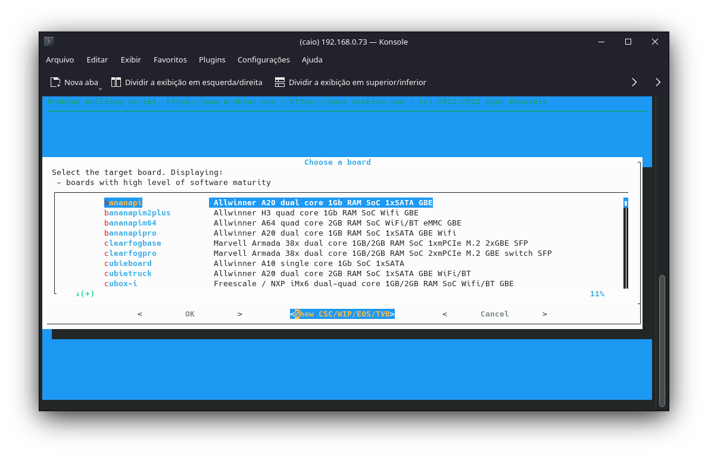

Leia o aviso e concorde:

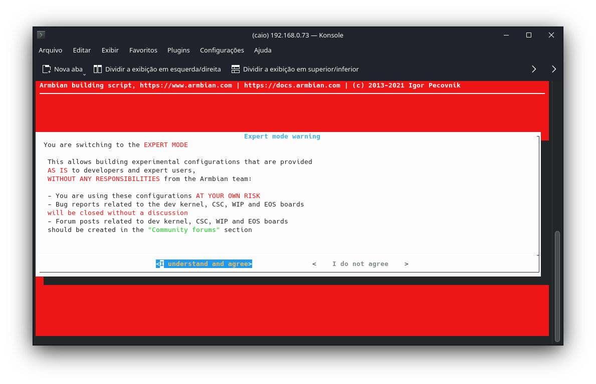

Navegue pelo menu até encontrar a opção da rk322x-box:

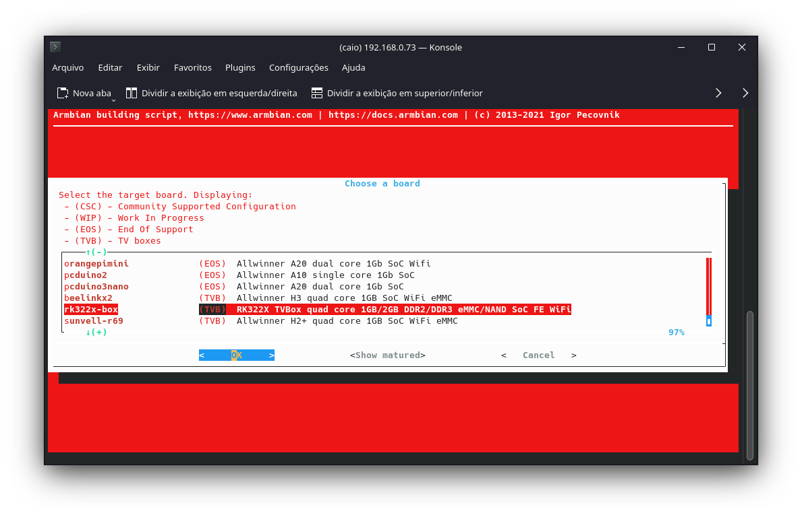

Escolha o kernel current:

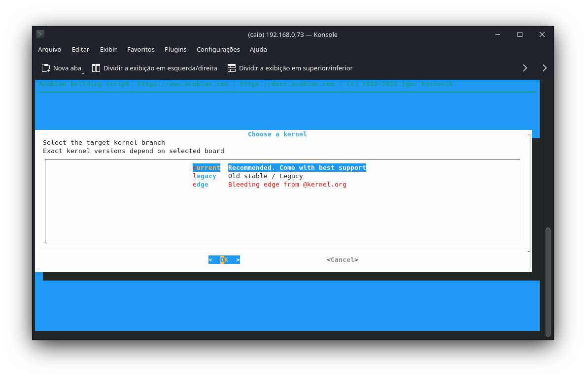

Escolha a distribuição. Recomendo a última versão disponível do debian (bullseye no momento da escrita):

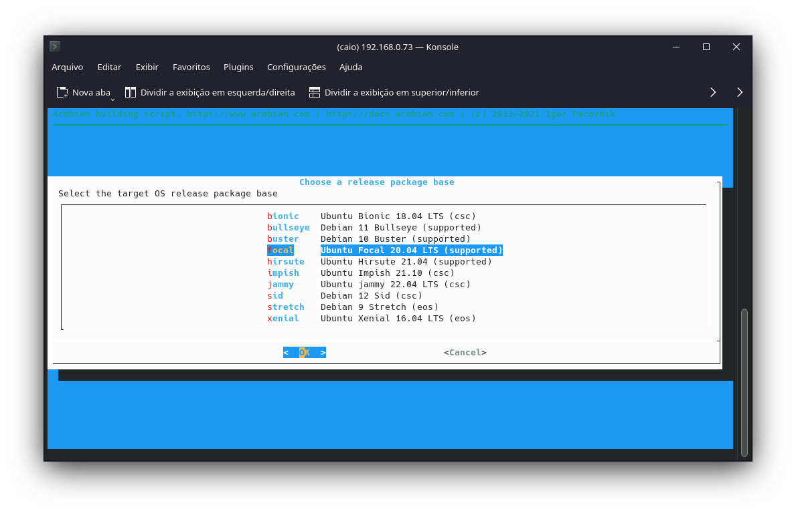

Escolha a imagem com interface de console (não precisamos de interface gráfica):

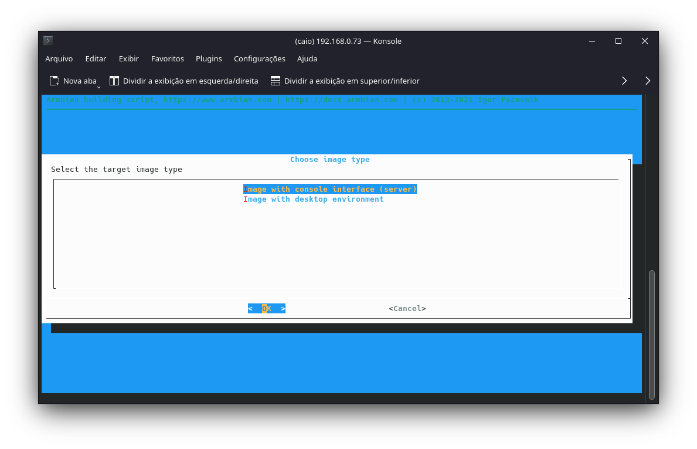

Escolha a imagem mínima:

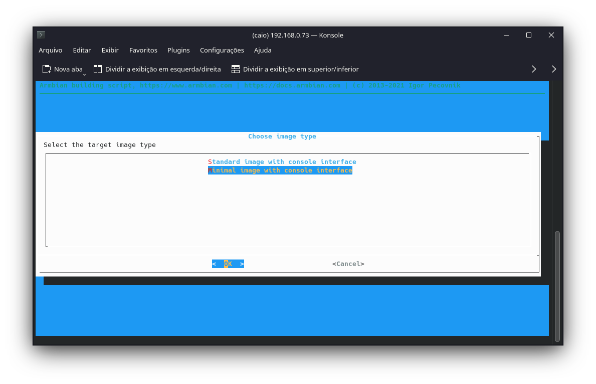

Esse script vai automaticamente baixar o código fonte, pacotes adicionais que estejam faltando na sua máquina e todos os arquivos de configuração necessários. Isso pode demorar de alguns
minutos até algumas horas, dependendo da sua internet e velocidade do processador, aguarde o script rodar até a janela de configuração do kernel. Abaixo mostro como é a janela de configuração do nconfig
para o kernel 5.15, sua tela pode ser um pouco diferente mas as opções serão as mesmas. Vá até a opção de device drivers:

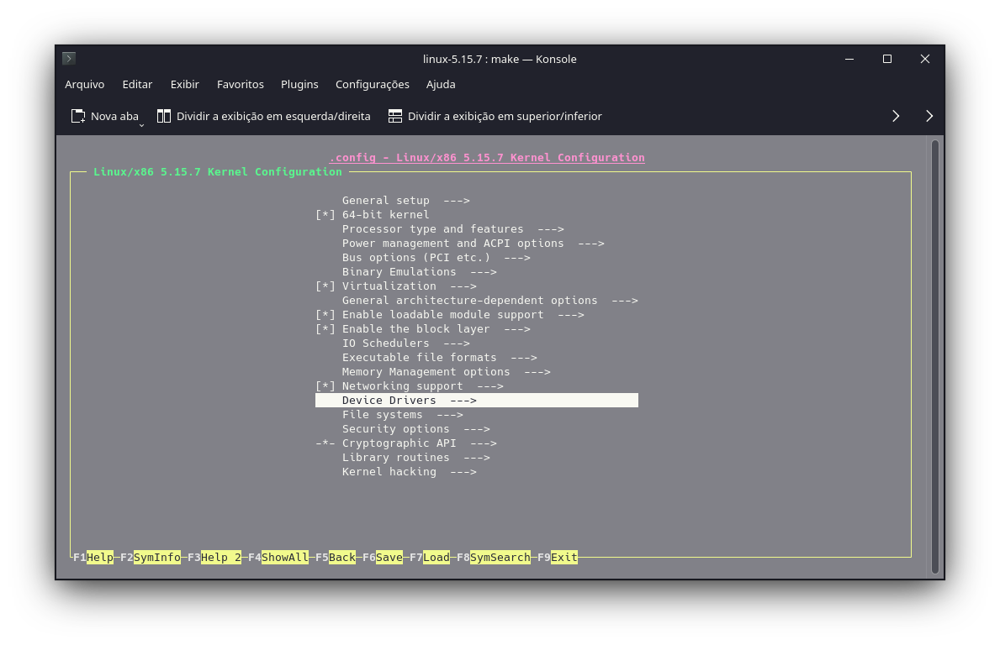

Encontre a configuração de suporte USB:

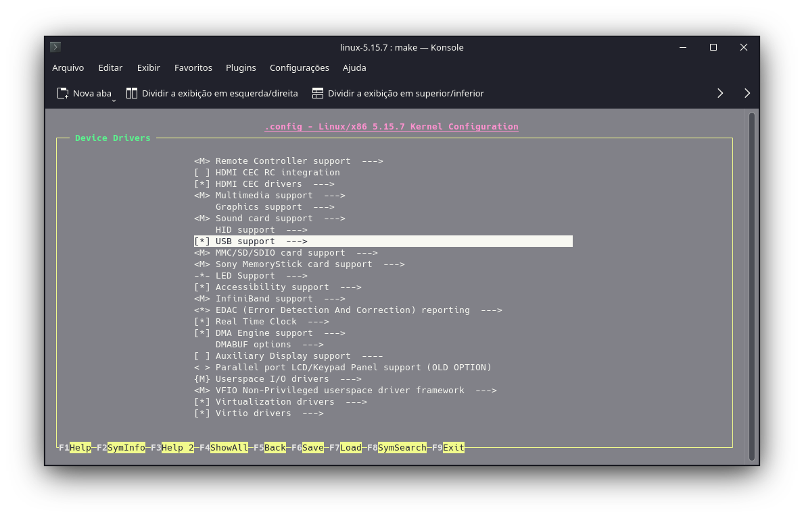

Finalmente, marque todas as opções relacionadas ao suporte USB/IP: VHCI HCD, Host driver e VUDC driver:

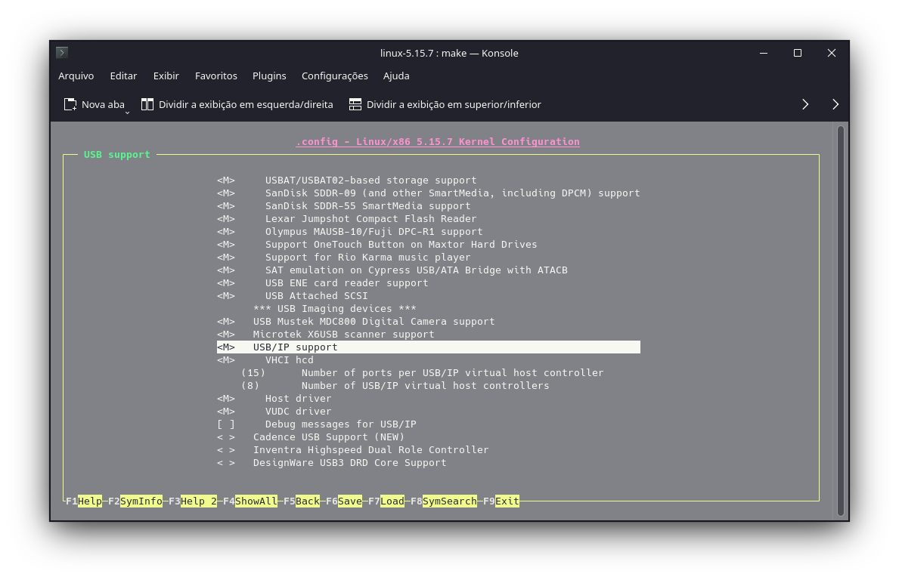

É isto! Agora basta aguardar o (longo) processo de compilação da imagem. 

Preparando o cartão SD
++++++++++++++++++++++++++++++++++++++++++++++

Será necessário um cartão SD para a instalação do sistema. Baixe a última versão do multitool: 
https://users.armbian.com/jock/rk322x/multitool.img.xz e grave no cartão usando o gravador de sua preferência. Na minha opinião o programa dd do linux é o mais prático, caso queira
um programa com interface gráfica recomendo o balena etcher: https://www.balena.io/etcher/. Após gravar o multitool, copie a imagem compilada no passo acima para o cartão SD dentro da pasta
"images".

Instalando o sistema
+++++++++++++++++++++++++++++++

Ligue um monitor e um teclado na TVBox. Insira o cartão e alimente a placa, ela iniciará automaticamente na interface do multitool. Recomendo fazer um backup da flash atual, e em seguida escolha a opção "Burn image to flash",
escolha o dispostivo eMMC que aparece e aguarde o processo de instalação. Após o término, reinicie a placa e remova o cartão, aguarde o debian subir e configure a senha e o usuário do sistema. Pronto! Sua TVBox agora é um poderoso
computador de bordo rodando um sistema livre e gratuito:

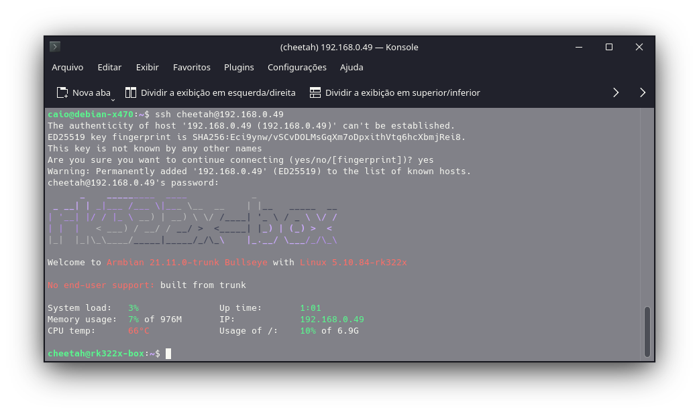

Configurações iniciais
++++++++++++++++++++++++++++++++++++++++++++++++++++

É necessário conectar a TVBox à internet (via cabo) para as próximas etapas. Recomendo também utilizar ssh para a configuração pois facilita copiar e colar comandos no terminal. Atualize o sistema operacional com (é provavel que esteja atualizado, mas é sempre bom conferir):

::

  sudo apt update && sudo apt upgrade

Rode o configurador do sistema com:

::

  sudo rk322x-config

Escolha o modelo do processador (rk3229 para essa TVBox):

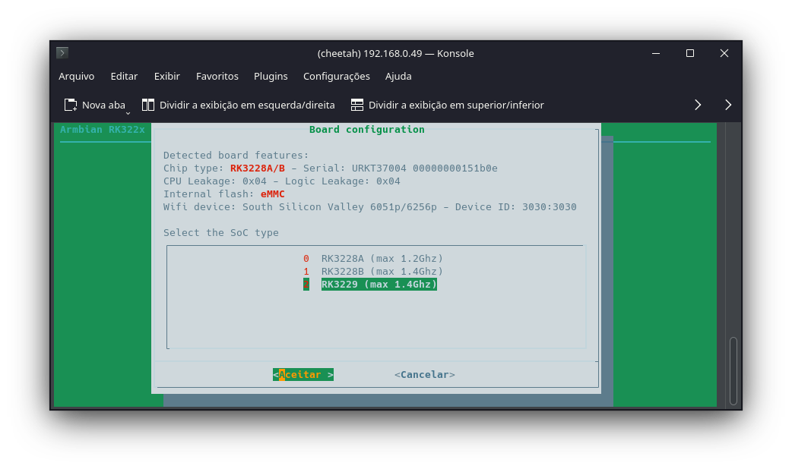

Escolha a memória eMMC:

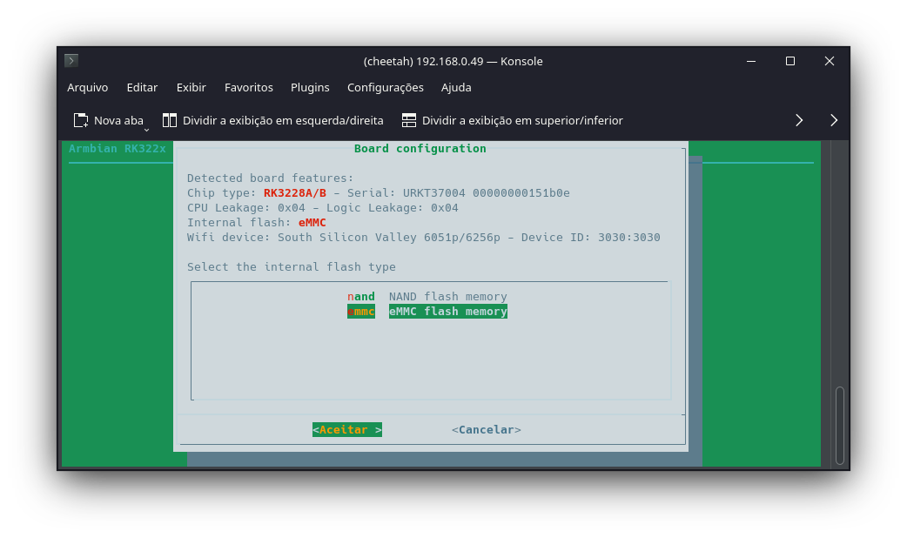

Escolha essa configuração para os leds:

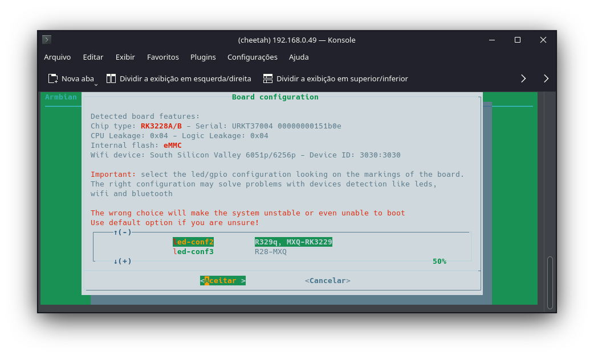

Em seguida, reinicie a placa. 

Configurando o servidor do sistema supervisório 
+++++++++++++++++++++++++++++++++++++++++++++++++++++++++

Para instalar o servidor de telemetria da equipe, é necessário ter os seguintes pacotes instalados:

::

  sudo apt update && sudo apt install build-essential nodejs npm mariadb-server screen apache2 php git

Após a instalação, clone o repositório com:

::

  git clone https://github.com/TelemetriaCheetah/Supervisorio.git

Antes de rodar o sistema pela primeira vez, será necessário criar uma nova database e configurar um novo usuário. Execute o configurador inicial do mariadb com:

::

  sudo mysql_secure_installation

E deixe as opções padrão. Em seguida, abra o console com:

::

  sudo mariadb

Crie um novo usuário com:

::

  CREATE USER 'cheetah'@localhost IDENTIFIED BY 'cheetahporran';

Dê todos os privilégios para o novo usuário:

::

  GRANT ALL PRIVILEGES ON *.* TO 'cheetah'@localhost IDENTIFIED BY 'cheetahporran';

Recarregue os privilégios:

::

  FLUSH PRIVILEGES;

Crie um novo banco de dados:

:: 

  CREATE DATABASE telemetriaCheetah;

Saia do prompt do mariadb com exit. Finalmente, agora é só instalar os módulos de nodejs com o comando:

::

  npm install  

Com os módulos instalados, o sistema está pronto para rodar o servidor de telemetria. Execute um teste com 

::

  node validaSemSerial.js

E se conecte na interface de teste pelo navegador com IP_DA_TVBOX:2000.