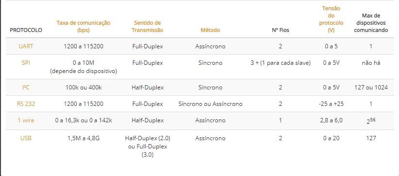
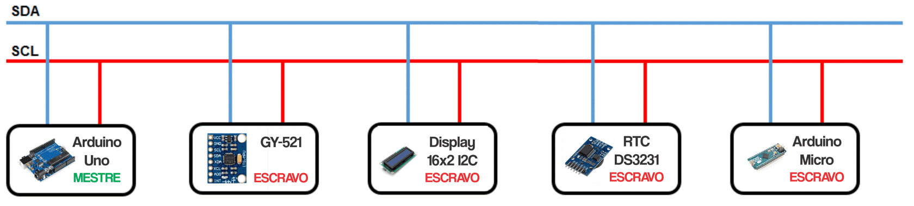
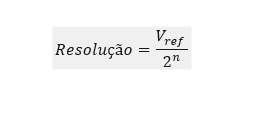
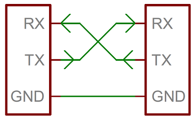
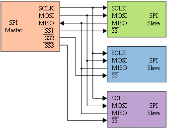

Tipos de Comunicações
************************

(Texto introdutorio)

Tabela de Comunicações
==========================

I²C
==========================
Descrição
------------
O modo de funcionamento do protocolo I2C é baseado na interação entre elementos seguindo a hierarquia mestre/escravo, ou seja, quando temos vários dispositivos se comunicando segundo esta premissa, pelo menos um destes deve atuar como mestre e os demais serão escravos. A função do mestre consiste em realizar a coordenação de toda a comunicação, ou seja, colocar em prioridade qual informação deve ser enviada primeiro de acordo com os requisitos.
Está é a forma da estrutura:

  
O barramento de comunicação I2C pode ser dividido em duas formas:
->SDA (Serial Data), o qual, é responsável pela troca de dados entre os dispositivos do arranjo
->SCL (Serial Clock), possui a função de sincronizar os dispositivos e garantir a confiabilidade do sistema.
Para distinguir cada sensor e ou modulo é necessário saber o endereço de barramento no qual deve ser único para cada, por isso é necessário utilizar um programa de busca para saber está informação e se for necessário alterá-lo.

Analógica
==========================
Descrição
------------
A comunicação é utilizada quando uma grandeza pode assumir infinitos valores de acordo com o tempo, como temperatura, pressão e umidade. Entretanto os controladores leem apenas valores digitais, por isso é necessário converter de acordo com sensor e ou modulo uma forma de transformação.
Um conversor A/D quantifica o valor analógico conforme a quantidade de bits da sua resolução. A resolução de um conversor A/D é dada pela seguinte equação:

Vref: Tensão de referência do conversor A/D
N: número de Bits do conversor.

Digital
==========================
Descrição
------------
A comunicação digital é aquela que as respostas da 0 ou 1, ou seja, trabalha com valores verdadeiros e falsos. Por padrão os pinos digitais dos controladores estão configurados como entradas digitais, porém, para ficar mais explícito na programação, deve-se configurar o pino como entrada. Dessa forma o pino é colocado em um estado de alta impedância, equivalente a um resistor de 100 MegaOhms em serie com o circuito a ser monitorado. Dessa forma, o pino absorve uma corrente muito baixa do circuito que está monitorando. Devido a essa característica de alta impedância, quando um pino colocado com entrada digital encontrasse flutuando (sem ligação definida), o nível de tensão presente nesse pino fica variando não podendo ser determinado um valor estável devido a ruido elétrico e até mesmo capacitância de entrada do pino. Para resolver esse problema é necessário colocar um resistor de pull up (ligado a +5V) ou um resistor de pull down (ligado a GND) conforme a necessidade. Esses resistores garantem nível lógico estável quando por exemplo uma tecla não está pressionada. Geralmente utiliza-se um resistor de 10K para esse propósito.

OneWire
==========================
Descrição
------------
1-Wire é um tipo de comunicação, um sistema de barramento projetado pela Dallas Semiconductor Corpo. que provê dados de baixa velocidade, sinalização e sinal único de energia.[1] 1-Wire tem um conceito similar ao do I²C, mas com taxas mais baixas de dados e maior alcance. O 1-Wire é basicamente um acessório pequeno e utilizado em funções digitais e também em instrumentos de medição de temperatura (termômetro). Uma rede de dispositivos 1-Wire associados com um Mestre, é chamada de MicroLan.

Um diferencial do barramento 1-Wire é o fato de utilizar apenas dois cabos: dados e GND. Para isso, o dispositivo 1-Wire dispõe de um capacitor de 800 pF para armazenar carga e alimentar o dispositivo durante os períodos onde o cabo de dados estiver sendo usado para o tráfego de dados.

Uart
==========================
Descrição
------------
É um protocolo utilizado por muitos microcontroladores, pois é responsável pela conversão da comunicação paralela em serial, que na maioria das vezes é convertida em outro protocolo como por exemplo o controlador da placa BlackBoard ou Arduino Uno, que utiliza o protocolo UART mas tem o protocolo convertido para USB.
Funcionamento: o pino de transmissão (Tx) do protocolo envia um pacote de bits que será interpretado bit a bit pelo pino receptor. Cada pacote enviado contém 1 start bit que indica o início da mensagem, 1 ou 2 stop bits para indicar o final da mensagem, 5 a 9 bits de informação e 1 bit de paridade para evitar a recepção de erros.
Ligação: por ser uma comunicação assíncrona a comunicação é feita por dois pinos Rx/Tx que dependem do baud rate como referência.

SPI
==========================
Descrição
------------
A comunicação SPI possui algumas características básicas. Primeiramente os sinais de comunicação possuem uma direção fixa e definida. Isso significa que sempre existem dois transistores definindo o estado de um pino (Push-Pull). Essa característica é uma das grandes diferenças entre outras comunicações seriais como I2C e OneWire, que possuem um mesmo barramento de dados para os sinais de entrada e saída através do esquema de dreno-aberto (Pull-Up).
Apesar de utilizar dois sinais de comunicação de dados em vez de um, é possível atingir velocidades maiores de comunicação. Isso porque há pouca deformação do sinal.
Outra característica é que toda troca de dados acontece sempre em ambas as direções. Em outras palavras, cada bit trocado entre o Master e um Slave traz um bit do Slave para o Master. Dessa forma, definimos que a comunicação é sempre full-duplex

O sinal de SS da SPI funciona como Seleção de Escravo (Slave Select). É um sinal ativo em nível baixo, o que significa que o dispositivo é selecionado quando este pino se encontra em nível baixo. No entanto, muitos dispositivos utilizam este sinal como sincronismo de frame. Dessa forma, é um sinal importante que deve ser respeitado.