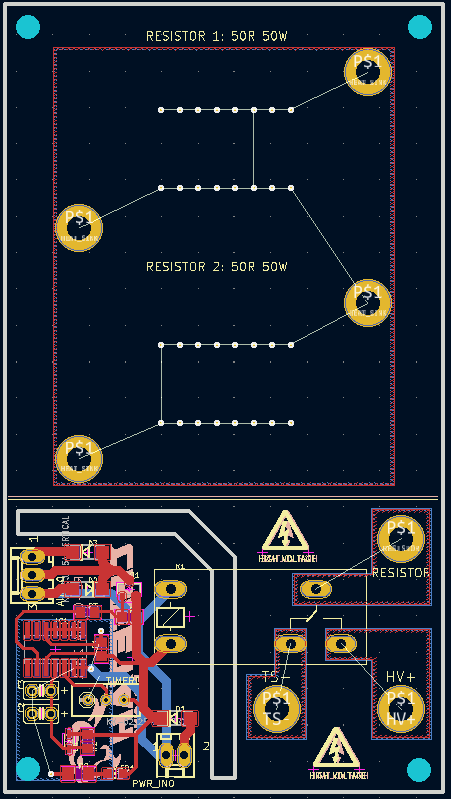

2020 Design Summary
************************

Posicionamento de Placas
=============================

  Posicionamento componentes 2019

  Posicionamento componentes 2022

* Impressão 3D
* Conectores wire-to-board

Alimentação 
==============

* Bateria 4s5p 14,8V 10Ah
* 3x conversor DC-DC 150 W

Circuito de Segurança
=========================

* Microcontrolador para aquisição de dados (ATmega328p)
* PWM IMD, Setpoint sensor de freios, sensor hall (BSPD), Tensão sensor hall, sensor de freios, bms e imd, saída dos latches, reset mestre, feedback shutdown, estado auto-teste
* Autoteste isolado da operação normal através de chaves bidirecionais
* Buffers em todas as tensões lidas pelo MCU 
* Saídas para shutdown isoladas por opto 
* Alimentação do shutdown independente
* Estágio do shutdown controlável por CAN 
* LEDs RGB para debug
* **Esquemático:** :download:`Baixar esquemático em PDF </docs/cs_sch.pdf>`
* **Layout:** :download:`Baixar layout em PDF </docs/cs_pcb.pdf>`

Placa de Isolação
==================

* Isolação por optoacoplador de alta velocidade 6N137 (máx 10mbps)
* Microcontroladores STM32F103C8T6 
* UART com DMA 
* Modo de operação legado com entradas e saídas digitais e analógicas disponíveis 
* LEDs RGB para debug rápido de cada estágio
* `Projeto no github <https://github.com/TelemetriaCheetah/Placas>`_
* **Esquemático:** :download:`Baixar esquemático em PDF </docs/>`
* **Layout:** :download:`Baixar layout em PDF </docs/>`

TSAL
=============

* Construção em 2 peças encaixáveis
* Substitiução de LEDs independentes por fita de LED
* **Esquemático:** :download:`Baixar esquemático em PDF </docs/>`
* **Layout:** :download:`Baixar layout em PDF </docs/>`

Pré-Carga
=============

* Dimensionamento dos resistores (100R) corrigido com valor de capacitância fornecido pela WEG (10mF)
* **Esquemático:** :download:`Baixar esquemático em PDF </docs/>`
* **Layout:** :download:`Baixar layout em PDF </docs/>`

Fusíveis
==========

* Conector AMPSEAL-23 wire-to-board
* Fusível GLV na placa 
* Saídas para conversores DC-DC
* `Projeto no github <https://github.com/TelemetriaCheetah/Placas>`_
* **Esquemático:** :download:`Baixar esquemático em PDF </docs/>`
* **Layout:** :download:`Baixar layout em PDF </docs/>`

Placa do carregador
=======================

* **Esquemático:** :download:`Baixar esquemático em PDF </docs/>`
* **Layout:** :download:`Baixar layout em PDF </docs/>`

Telemetria
====================

* Integração CAN
* Tensão nos pontos do shutdown 
* Integração com BMS e Inversor
* Programação sem fio BMS, Inversor, Telemetria Traseira, CS 
* Display LCD 7 polegadas
* Transmissão por rádios 915 Mhz (LR) e 2,4 GHz (SR)

Telemetria Frontal
=======================

* Microcontrolador STM32F103C8T6
* Leitura dos dados dos TPS, pressão de freios, shutdown
* `Projeto no github <https://github.com/TelemetriaCheetah/Placas>`_
* **Esquemático:** :download:`Baixar esquemático em PDF </docs/>`
* **Layout:** :download:`Baixar layout em PDF </docs/>`

Telemetria Traseira
========================

* Microcontrolador ESP32 
* Leitura dos dados shutdown, IMU, GPS, bateria GLV
* `Projeto no github <https://github.com/TelemetriaCheetah/Placas>`_
* **Esquemático:** :download:`Baixar esquemático em PDF </docs/>`
* **Layout:** :download:`Baixar layout em PDF </docs/>`

Telemetria de Rodas
====================

* Microcontrolador STM32F103C8T6
* Rotação e temperatura disco de freios
* `Projeto no github <https://github.com/TelemetriaCheetah/Placas>`_
* **Esquemático:** :download:`Baixar esquemático em PDF </docs/>`
* **Layout:** :download:`Baixar layout em PDF </docs/>`

Computador de bordo
=======================

* Processador Rockchip RK3229 Quad Core Cortex A7
* Armbian bullseye
* 4 GB RAM / 32 GB eMMC