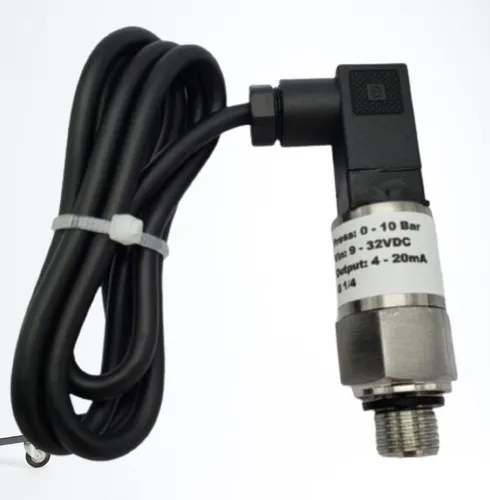

Sensores
************************

Nessa página estão listados os sensores que compõe o subsistema de telemetria do
Cheetah E-Racing. Aqui você encontra informações sobre as características físicas,
especificações técnicas, implementação de software e uso geral de cada um deles.
Datasheets e Application Notes também são referenciados de acordo com a necessidade.

Bibliotecas (Arduino)
======================

Essa seção lista as bibliotecas necessárias para utilizar os sensores em um ambiente Arduino. A instalação é simples, e requer apenas
a extração dos arquivos que devem ser baixados nos links abaixo para a pasta Arduino/libraries.

* `OneWire <https://blogmasterwalkershop.com.br/arquivos/libs/OneWire.zip>`_
* `DallasTemperature <https://blogmasterwalkershop.com.br/arquivos/libs/DallasTemperature.zip>`_
* `Adafruit-MLX90614 <https://github.com/adafruit/Adafruit-MLX90614-Library/tree/1.1.1>`_

Acelerômetro e Giroscópio
==========================

Descrição
------------

Nesse módulo GY-521 você tem em uma mesma placa um acelerômetro e um giroscópio de alta precisão, tudo isso controlado por um 
único CI, o MPU-6050. São 3 eixos para o acelerômetro e 3 eixos para o giroscópio, sendo ao todo 6 graus de liberdade (6DOF). 
Além disso esta placa tem um sensor de temperatura embutido no CI, permitindo medições entre -40 e +85 ºC. Possui alta precisão
devido ao conversor analógico digital de 16-bits para cada canal. Portanto o sensor captura os canais X, Y e Z ao mesmo tempo. 
Essa placa utiliza o protocolo I2C para transmissão de dados.

**Especificações e características**

* `Datasheet <https://cdn.awsli.com.br/945/945993/arquivos/MPU-6050_DataSheet_V3%204.pdf>`__
* Tensão de Operação: 3-5V
* Conversor AD 16 bits
* Faixa do Giroscópio: ±250, 500, 1000, 2000°/s
* Faixa do Acelerômetro: ±2, ±4, ±8, ±16g
* Dimensões: 20 x 16 x 2 mm

Uso
-----

A comunicação com o microcontrolador usa a interface I2C, por meio dos pinos SCL e SDA do sensor. Nos pinos XDA e XCL você pode 
ligar outros dispositivos I2C. A alimentação do módulo pode variar entre 3 e 5v, mas para melhores resultados e precisão recomenda-se 
utilizar 5v.

Objetivo
------------

Utilizamos o giroscópio para o monitoramento da orientação, direção, movimentação angular e rotação do veículo. 
O acelerômetro terá a finalidade de medir a aceleração, ângulo de inclinação, rotação, vibração, colisão e gravidade do veículo. 

Temperatura - Dutos de ar
==========================

Descrição
------------

São usados 2 sensores de temperatura do modelo DS18B20 da Dallas Semiconductors, posicionados no início e no final do duto de ar
. Esse sensor usa a comunicação `OneWire <https://www.maximintegrated.com/en/design/technical-documents/tutorials/1/1796.html>`__.

**Especificações e características**

* `Datasheet <https://datasheets.maximintegrated.com/en/ds/DS18B20.pdf>`__
* Tensão de operação: 3 – 5,5VDC
* Faixa de medição: -55°C a 125° celsius (recomenda-se no máximo 100º)
* Precisão: ±0,5° celsius
* Resolução: 9 ou 12 bits (configurável)
* Período de atualização: menor que 750ms

Uso
-----

Falar sobre a implementação no Cheetah aqui

Código de teste (Arduino IDE)
--------------------------------

.. code-block:: c++
  :linenos:

  #include <OneWire.h> //INCLUSÃO DE BIBLIOTECA
  #include <DallasTemperature.h> //INCLUSÃO DE BIBLIOTECA

  #define DS18B20 7 //DEFINE O PINO DIGITAL UTILIZADO PELO SENSOR

  OneWire ourWire(DS18B20); //CONFIGURA UMA INSTÂNCIA ONEWIRE PARA SE COMUNICAR COM O SENSOR
  DallasTemperature sensors(&ourWire); //BIBLIOTECA DallasTemperature UTILIZA A OneWire

  void setup()
  {
    Serial.begin(9600); //INICIALIZA A SERIAL
    sensors.begin(); //INICIA O SENSOR
    delay(1000); //INTERVALO DE 1 SEGUNDO
  }

  void loop()
  {
    sensors.requestTemperatures();//SOLICITA QUE A FUNÇÃO INFORME A TEMPERATURA DO SENSOR
    Serial.print("Temperatura: "); //IMPRIME O TEXTO NA SERIAL
    Serial.print(sensors.getTempCByIndex(0)); //IMPRIME NA SERIAL O VALOR DE TEMPERATURA MEDIDO
    Serial.println("*C"); //IMPRIME O TEXTO NA SERIAL
    delay(250);//INTERVALO DE 250 MILISSEGUNDOS
  }

Objetivo
------------

Objetivo do sensor validar os sidepods (dutos) é verificar o quão efetivo é o
resfriamento da caixa de bateria, local para onde estão voltados os dutos. Para
isso são necessários 2 sensores DS18B20 para dois testes diferentes: no primeiro,
que será realizado avaliando somente um duto de cada vez, um sensor seria colocado
na entrada do duto e o outro na saída, para que seja obtida a diferença entre essas
temperaturas. Dessa forma é possível verificar a geometria escolhida dos dutos
comparando com dados de simulações. No segundo teste os sensores serão colocados
nas laterais da caixa de bateria, onde incide o ar vindo dos dutos. Assim serão
coletados os dados de temperatura da caixa de baterias com e sem dutos. Dessa
forma sendo verificada a eficiência dos dutos no carro.

Temperatura - Freios
======================

Descrição
------------

Há no carro 4 sensores infravermelhos, que são sensores de temperatura do modelo
mlx90614 e fabricante Melexis, posicionados em cada roda próximo aos
discos de freio. Os sensores utilizam comunicação `I²C <http://www.univasf.edu.br/~romulo.camara/novo/wp-content/uploads/2013/11/Barramento-e-Protocolo-I2C.pdf>`_.

**Especificações e características**

* `Datasheet <https://img.filipeflop.com/files/download/Datasheet_MLX90614.pdf>`__
* Sensor de temperatura IR infravermelho
* Controlador MLX90614ESF
* Saída com resolução de 10-bit PWM
* Faixa de temperatura ambiente: -40 a 125°C
* Faixa de temperatura para objetos: -70 a 380°C
* Precisão: ±0,5°C
* Tensão de operação: 3VDC
* Dimensões: 17 x 11,5 x 6 mm

.. warning::
  O sensor vem calibrado de fábrica para trabalhar com objetos com emissividade 1. É necessário alterar esse valor
  de acordo com a emissividade do material medido.

Uso
-----

Falar sobre a implementação no Cheetah aqui

Código de teste (Arduino IDE)
--------------------------------

.. code-block:: c++
  :linenos:

  //Programa: Sensor de temperatura I2C MLX90614 Arduino
  //Autor: Arduino e Cia
  #include <Wire.h>
  #include <Adafruit_MLX90614.h>
  Adafruit_MLX90614 mlx = Adafruit_MLX90614();
  //Define o endereco I2C do display e qtde de colunas e linhas
  LiquidCrystal_I2C lcd(0x3B, 16, 2);
  //Array que desenha o simbolo de grau
  byte grau[8] = {B00110, B01001, B01001, B00110,
                  B00000, B00000, B00000, B00000,};
  double temp_amb;
  double temp_obj;
  void setup()
  {
    Serial.begin(9600);
    Serial.println("Sensor de temperatura MLX90614");
    //Inicializa o MLX90614
    mlx.begin();
  }
  void loop()
  {
    //Leitura da temperatura ambiente e do objeto
    //(para leitura dos valores em Fahrenheit, utilize
    //mlx.readAmbientTempF() e mlx.readObjectTempF() )
    temp_amb = mlx.readAmbientTempC();
    temp_obj = mlx.readObjectTempC();
    //Mostra as informacoes no Serial Monitor
    Serial.print("Ambiente = ");
    Serial.print(temp_amb);
    Serial.print("*CtObjeto = ");
    Serial.print(temp_obj); Serial.println("*C");
    //Aguarda 1 segundo ate nova leitura
    delay(1000);
  }

Objetivo
------------

O objetivo do sensor é saber a temperatura dos freios durante a corrida para que a subequipe
de freios possa conferir com os dados teóricos e ver a porcentagem de erro.
O sensor sabe a temperatura especifica e a do ambiente.

Indutivo
==========================

Usamos 4 sensores indutivos do modelo PS2-12GI50-E2-Ex fabricante Sense, com
comunicação `OneWire <https://www.maximintegrated.com/en/design/technical-documents/tutorials/1/1796.html>`__. Usado para saber a velocidade de cada pneu,
ficam acoplados um em cada roda perto dos furos da roda fônica,
não é necessário um conector especifico irão para o chicote e do chicote para as placas.

Descrição
------------

**Especificações e características**

* `Datasheet <https://www.sense.com.br/produtos/detalhes/10398/por/1/1/sensores/sensores-indutivos-tubulares-standard/PS2-12GI50-E2-Ex>`__
* Tensão de alimentação: 10 a 30Vcc
* Ripple: ±10 %
* Corrente de consumo: <10 mA
* Diâmetro: 	M12
* Distancia sensora: 2 mm
* Montagem 	Embutida
* Histerese: ± 5 %
* Repetibilidade: 	<0,01 mm
* Distancia operacional: 1,62 mm
* Alvo padrão: 12x12 mm
* Peso: 	110 g

Uso
-----

O sensor funciona com uma tensão de 12V, utilizam-se resistores para diminuir e enviar um sinal de 3v para o microcontrolador,
também é necessário ficar uma distância de 3mm (Verificar datasheet). Recebemos as informações a partir de interrupções, logo temos varias maneiras de saber sua velocidade como:

.. image:: images/indutivo_formula.png
  :align: center

Mas no programa usamos a velocidade a partir de funções de tempo.

Código de teste (Arduino IDE)
--------------------------------

.. code-block:: c++
  :linenos:

    /*
    Analog input, analog output, serial output

    Reads an analog input pin, maps the result to a range from 0 to 255 and uses
    the result to set the pulse width modulation (PWM) of an output pin.
    Also prints the results to the Serial Monitor.

    The circuit:
    - potentiometer connected to analog pin 0.
      Center pin of the potentiometer goes to the analog pin.
      side pins of the potentiometer go to +5V and ground
    - LED connected from digital pin 9 to ground

    created 29 Dec. 2008
    modified 9 Apr 2012
    by Tom Igoe

    This example code is in the public domain.

    http://www.arduino.cc/en/Tutorial/AnalogInOutSerial
  */

  // These constants won't change. They're used to give names to the pins used:
  const int analogInPin = A0;  // Analog input pin that the potentiometer is attached to
  const int analogOutPin = 9; // Analog output pin that the LED is attached to

  int sensorValue = 0;        // value read from the pot
  int outputValue = 0;        // value output to the PWM (analog out)

  void setup() {
    // initialize serial communications at 9600 bps:
    Serial.begin(9600);
  }

  void loop() {
    // read the analog in value:
    sensorValue = analogRead(analogInPin);
    // map it to the range of the analog out:
    outputValue = map(sensorValue, 0, 1023, 0, 255);
    // change the analog out value:
    analogWrite(analogOutPin, outputValue);

    // print the results to the Serial Monitor:
    Serial.print("sensor = ");
    Serial.print(sensorValue);
    Serial.print("\t output = ");
    Serial.println(outputValue);

    // wait 2 milliseconds before the next loop for the analog-to-digital
    // converter to settle after the last reading:
    delay(2);
  }

Objetivo
------------

Objetivo do sensor Indutivo é saber a velocidade média, análises gerais como ponto de frenagens,
acelerações, comparações de voltas para a correção de pilotagem

Relógio de tempo real
====================================

Descrição
------------
O módulo de relógio em tempo real fornece informações precisas de horário para o microcontrolador embarcado,
através do protocolo `I²C <http://www.univasf.edu.br/~romulo.camara/novo/wp-content/uploads/2013/11/Barramento-e-Protocolo-I2C.pdf>`_.

**Especificações e características**

* `Datasheet <https://datasheets.maximintegrated.com/en/ds/DS1307.pdf>`__
* Computa segundos, minutos, horas, dias da semana, dias do mês, meses e anos (de 2000 a 2099).
* 56 bytes de SRAM que podem ser usadas como RAM extendida do microcontrolador.
* Circuito de detecção de falha de energia.
* Consome menos de 500nA no modo bateria com oscilador em funcionamento.
* Faixa de temperatura: -40°C a +85°C.
* Dimensões: 27 x 28 x 8,4mm

Uso
-----

Código de teste (Arduino IDE)
--------------------------------

.. code-block:: c++
  :linenos:

  //Programa : Relogio com modulo RTC DS1307
  //Autor : FILIPEFLOP

  //Carrega a biblioteca do RTC DS1307
  #include <DS1307.h>

  //Modulo RTC DS1307 ligado as portas A4 e A5 do Arduino
  DS1307 rtc(A4, A5);

  void setup()
  {
    //Aciona o relogio
    rtc.halt(false);

    //As linhas abaixo setam a data e hora do modulo
    //e podem ser comentada apos a primeira utilizacao
    rtc.setDOW(FRIDAY);      //Define o dia da semana
    rtc.setTime(20, 37, 0);     //Define o horario
    rtc.setDate(6, 6, 2014);   //Define o dia, mes e ano

    //Definicoes do pino SQW/Out
    rtc.setSQWRate(SQW_RATE_1);
    rtc.enableSQW(true);

    Serial.begin(9600);
  }

  void loop()
  {
    //Mostra as informações no Serial Monitor
    Serial.print("Hora : ");
    Serial.print(rtc.getTimeStr());
    Serial.print(" ");
    Serial.print("Data : ");
    Serial.print(rtc.getDateStr(FORMAT_SHORT));
    Serial.print(" ");
    Serial.println(rtc.getDOWStr(FORMAT_SHORT));

    //Aguarda 1 segundo e repete o processo
    delay (1000);
  }

Objetivo
------------

O RTC é essencialmente utilizado na organização dos dados, fornecendo um horário e
uma data com precisão e baixo consumo.  Informando ano, mês, dia, hora(formato 12 ou 24),
minuto e segundo, com as devidas correções de mês e ano. Em caso de falha de energia
ele automaticamente aciona a bateria para evitar perda de dados.

Unidade de medida inercial
==================================

Descrição
------------

Modelo da placa, GY-80(um multi-sensor, IMU), função do acelerômetro, CI ADXL345 (3-Axis Digital Accelerometer).
Comunicação pela interface I2C, pinos SCL e SDA, com endereçamento individual. Como o modulo vai direto na placa central,
não se utiliza conector.

**Especificações e características**

* Protocolo de comunicação 	I2C
* Chip Acelerômetro 	ADXL345
* Endereço I2C 	0x53
* Faixa do Acelerômetro 	±2, ±4, ±8, ±16g
* Chip Giroscópio 	L3G4200D
* Endereço I2C 	0x69
* Faixa do Giroscópio 	±250, 500, 2000°/s
* Chip Magnetômetro 	HMC5883L
* Endereço I2C 	0x1E
* Chip Barômetro 	BMP085
* Endereço I2C 	0x77
* Tensão de operação 	3,3-5V
* Peso 	5g
* Dimensões 	25,8 x 16,8mm

* `Datasheet Acelerômetro <https://storage.googleapis.com/baudaeletronicadatasheet/ADXL345.pdf>`__
* `Datasheet Giroscópio <https://storage.googleapis.com/baudaeletronicadatasheet/L3G4200D.pdf>`__
* `Datasheet Bússola <https://storage.googleapis.com/baudaeletronicadatasheet/HMC5883L.pdf>`__
* `Datasheet Barômetro <https://storage.googleapis.com/baudaeletronicadatasheet/BMP085.pdf>`__

Uso
-----

Código de teste (Arduino IDE)
--------------------------------

.. code-block:: c++
  :linenos:

  // Programa : Teste Giroscopio L3G4200D
  // Adaptacoes : Arduino e Cia
  #include <Wire.h>
  #define CTRL_REG1 0x20
  #define CTRL_REG2 0x21
  #define CTRL_REG3 0x22
  #define CTRL_REG4 0x23
  #define CTRL_REG5 0x24
  //Endereco I2C do L3G4200D
  int L3G4200D_Address = 105;
  int x;
  int y;
  int z;
  void setup()
  {
    Wire.begin();
    Serial.begin(9600);
    Serial.println("Inicializando o L3G4200D");
    // Configura o L3G4200 para 200, 500 ou 2000 graus/seg
    setupL3G4200D(2000);
    // Aguarda a resposta do sensor
    delay(1500);
  }
  void loop()
  {
    // Atualiza os valores de X, Y e Z
    getGyroValues();
    // Mostra os valores no serial monitor
    Serial.print("X:");
    Serial.print(x);
    Serial.print(" Y:");
    Serial.print(y);
    Serial.print(" Z:");
    Serial.println(z);
    // Aguarda 100ms e reinicia o processo
    delay(100);
  }
  void getGyroValues()
  {
    // Rotina para leitura dos valores de X, Y e Z
    byte xMSB = readRegister(L3G4200D_Address, 0x29);
    byte xLSB = readRegister(L3G4200D_Address, 0x28);
    x = ((xMSB << 8) | xLSB);
    byte yMSB = readRegister(L3G4200D_Address, 0x2B);
    byte yLSB = readRegister(L3G4200D_Address, 0x2A);
    y = ((yMSB << 8) | yLSB);
    byte zMSB = readRegister(L3G4200D_Address, 0x2D);
    byte zLSB = readRegister(L3G4200D_Address, 0x2C);
    z = ((zMSB << 8) | zLSB);
  }
  int setupL3G4200D(int scale)
  {
    //From  Jim Lindblom of Sparkfun's code
    // Enable x, y, z and turn off power down:
    writeRegister(L3G4200D_Address, CTRL_REG1, 0b00001111);
    // If you'd like to adjust/use the HPF, you can edit the line below to configure CTRL_REG2:
    writeRegister(L3G4200D_Address, CTRL_REG2, 0b00000000);
    // Configure CTRL_REG3 to generate data ready interrupt on INT2
    // No interrupts used on INT1, if you'd like to configure INT1
    // or INT2 otherwise, consult the datasheet:
    writeRegister(L3G4200D_Address, CTRL_REG3, 0b00001000);
    // CTRL_REG4 controls the full-scale range, among other things:
    if(scale == 250){
      writeRegister(L3G4200D_Address, CTRL_REG4, 0b00000000);
    }else if(scale == 500){
      writeRegister(L3G4200D_Address, CTRL_REG4, 0b00010000);
    }else{
      writeRegister(L3G4200D_Address, CTRL_REG4, 0b00110000);
    }
    // CTRL_REG5 controls high-pass filtering of outputs, use it
    // if you'd like:
    writeRegister(L3G4200D_Address, CTRL_REG5, 0b00000000);
  }
  void writeRegister(int deviceAddress, byte address, byte val)
  {
      Wire.beginTransmission(deviceAddress); // start transmission to device
      Wire.write(address);       // send register address
      Wire.write(val);         // send value to write
      Wire.endTransmission();     // end transmission
  }
  int readRegister(int deviceAddress, byte address)
  {
      int v;
      Wire.beginTransmission(deviceAddress);
      Wire.write(address); // register to read
      Wire.endTransmission();
      Wire.requestFrom(deviceAddress, 1); // read a byte
      while(!Wire.available())
      {
          // waiting
      }
      v = Wire.read();
      return v;
  }

Objetivo
------------

Colocar o motivo do uso do sensor e para que ele valida, ou seja deixar exposto a informação. Exemplo: Um dos itens para validar os sidepods
(dutos) é verificar o quão efetivo é o resfriamento da caixa de bateria, local para onde estão voltados os dutos. Para isso é necessário 02
sensores DS18B20 para dois testes diferentes: no primeiro, que será realizado avaliando somente um duto de cada vez, um sensor seria colocado
na entrada do duto e o outro na saída, para que seja obtida a diferença entre essas temperaturas. Dessa forma é possível verificar a geometria
escolhida dos dutos comparando com dados de simulações. No segundo teste os sensores serão colocados nas laterais da caixa de bateria,
onde incide o ar vindo dos dutos. Assim serão coletados os dados de temperatura da caixa de baterias com e sem dutos. Dessa forma sendo verificada a eficiência dos dutos no carro.

Display LCD
==========================

Descrição
------------

Display LED mais o LCD genérico, QC2004A. Comunicação pela interface I2C, pinos SCL e SDA,  com endereçamento individual. Fixado no painel do carro e ligado, pelo chicote, direto para aplaca central.

**Especificações e características**

* `Datasheet <as>`__

Uso
-----

O modulo funciona com uma tensão de 5V.
Pinos utilizados são: Vcc 5V ; GND; SCL; SDA.

Código de teste (Arduino IDE)
--------------------------------

.. code-block:: c++
  :linenos:

Objetivo
------------

O display LCD é nada mais que um LED que mostra dados. Localizado no painel do carro para que
posamos mostrar ao piloto dados que achamos importantes que ele esteja constantemente ciente. Os dados são decididos pela equipe.

Pressão de freios
==========================

Descrição
------------

Sensor de pressão de freios modelo 53CP08 – 02 fabricante Sensata, utilizasse 2 sensores
um em cada linha de freios, do lado esquerdo inferior próximo ao pedal o outro próximo
da roda traseira, é necessário utilizar um conector de 3 vias para fixá-lo no carro. (VCC, GND, AN)

**Especificações e características**

https://br.mouser.com/Sensata-Technologies/Sensors/Pressure-Sensors/_/N-6g7qc?P=1y9lxqe (Loja da fabricante)
https://br.mouser.com/datasheet/2/657/ourproducts_2cp_datasheet-1511045.pdf (Datasheet do modelo semelhante)
https://www.tomodatipecas.com.br/produto/256228/conector-com-chicote-3-vias-sensor-de-posicao-da-borboleta-pressostato-ar-condicionado-fiat-vw-ford-gm-ete-7741 (Tipo de conector)

* `Datasheet <as>`__

Uso
-----

Ele funciona com VCC de 5v, GND e Sinal, pode-se saber o valor da pressão usando a função map, como a equação VOUT /VCC= (0.01*PIN[Bar G]+ 0.1)
(Verificar o datasheet).Para isso é necessário que a linha de freios esteja sangrada para ter a força necessária de pressão já que não é possível fazer outro teste de mesa.

Código de teste (Arduino IDE)
--------------------------------

.. code-block:: c++
  :linenos:

Objetivo
------------

O objetivo do sensor e verificar se os freios e a linha estão cumprindo com as expectativas da subequipe de freios.

Sensor de carga
==========================

Descrição
------------

Verificar o datasheet

**Especificações e características**

http://blog.eletrogate.com/balanca-digital-com-arduino-aprenda-a-usar-a-celula-de-carga/
https://www.baudaeletronica.com.br/sensor-de-peso-50kg-celula-de-carga.html

* `Datasheet <as>`__

Uso
-----

Código de teste (Arduino IDE)
--------------------------------

.. code-block:: c++
  :linenos:

Objetivo
------------

Objetivo do sensor é cruzar informações junto com o sensor de pressão de freios, para validar e relacionar a força que é aplicada com a pressão que a linha chega, já que temos a relação de pedal e o diâmetro do êmbolo do CM.

GPS
==========================

Descrição
------------

Modelo do modulo do sensor GPS, Adafruit Ultimatr GPS Breakout V3. Comunicação pela interface serial, pinos TX e RX. Como o modulo vai direto na placa central, não se utiliza conector.

**Especificações e características**

https://learn.adafruit.com/adafruit-ultimate-gps/downloads (datasheetes)

* `Datasheet <as>`__

Uso
-----

O modulo funciona com uma tensão tanto de 3.3V, quanto de 5V.
Pinos utilizados são: Vcc(3.3V ou 5V) ; GND; TX; RX;
Para a melhor recepção do sinal no modulo, se utiliza uma antena externa. Porém mesmo assim em diversos locais ocorre falha na recepção.

Código de teste (Arduino IDE)
--------------------------------

.. code-block:: c++
  :linenos:

Objetivo
------------

O GPS fornece diversos dados para serem coletados, o modulo é um receptor de dados do NMEA. Podemos obter o tempo(ano,  mês, dia, hora, minuto e segundo). Além da localização(latitude, longitude, altitude e ângulo), em que podemos mapear o percurso do veiculo. Também é medido a velocidade  em knots.

Diagrama de conexões
======================

.. image:: images/diagrama.png
  :align: center

Referências
================

* https://blogmasterwalkershop.com.br/arduino/como-usar-com-arduino-modulo-adaptador-i2c-para-display-lcd-16x2-20x4
* https://blogmasterwalkershop.com.br/arduino/como-usar-com-arduino-sensor-de-temperatura-ds18b20-prova-dagua-do-tipo-sonda
* https://www.arduinoecia.com.br/sensor-gy-80-arduino-acelerometro-bussola-barometro/
* https://www.arduinoecia.com.br/sensor-de-temperatura-mlx90614-arduino/
* https://www.filipeflop.com/produto/sensor-de-temperatura-ir-mlx90614/
* https://www.filipeflop.com/blog/relogio-rtc-ds1307-arduino/
