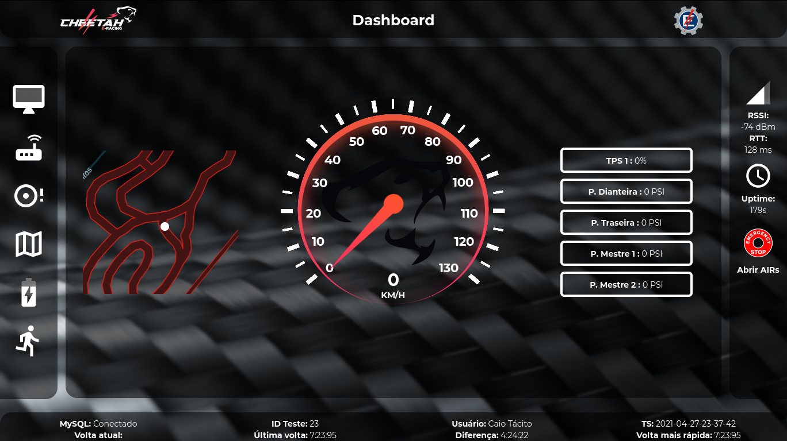
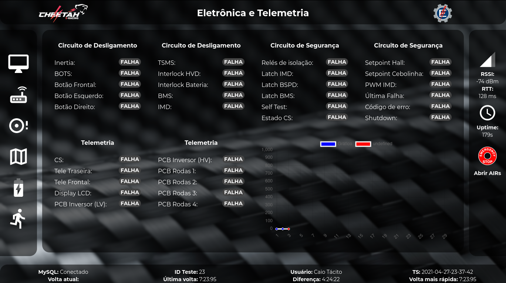
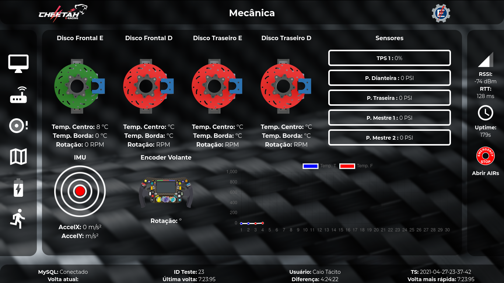
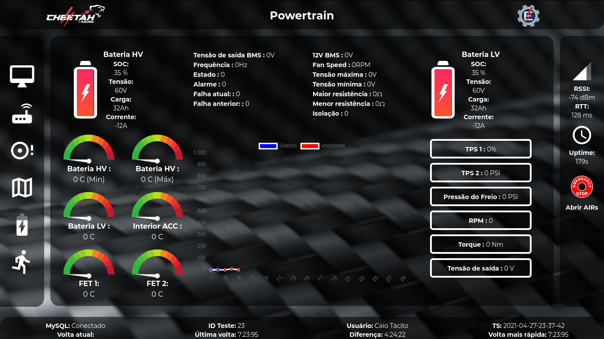
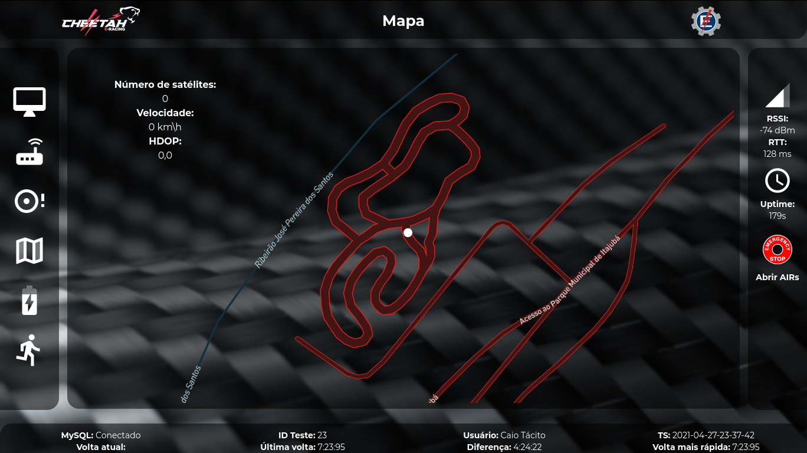
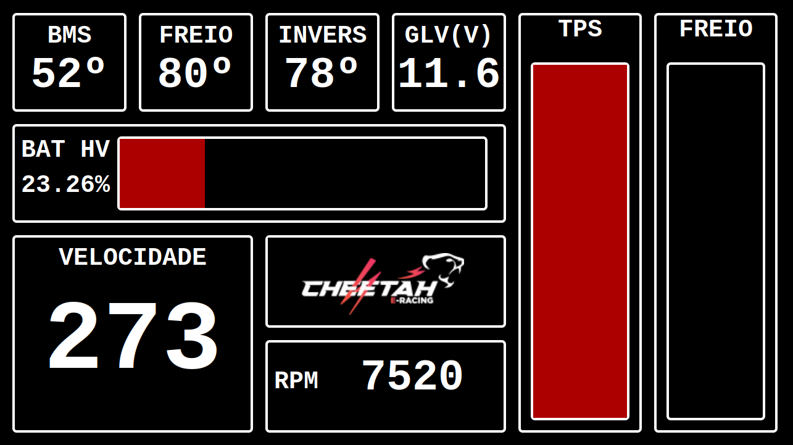

Supervisório
*****************

Nessa seção está documentado o código do sistema supervisório para torná-lo facilmente acessível a qualquer membro do Cheetah E-Racing interessado no seu funcionamento.
Nenhum conhecimento prévio é estritamente necessário para acompanhá-lo, porém qualquer experiência com linguagens de programação e desenvolvimento web será útil.

Servidor
===========

O processo de instalação e inicialização do servidor segue os mesmos passos apresentados na seção de manual do usuário.

.. note::

  Para facilitar o processo de desenvolvimento, recomenda-se a utilização do `nodemon <https://www.npmjs.com/package/nodemon>`__. O nodemon é um módulo do node.js que reinicia automaticamente o servidor
  quando algum dos arquivos javascript for alterado, e pode ser ativado utilizando o comando abaixo ao invés do mostrado no manual do usuário:

  .. code-block:: c++
    :linenos:

    nodemon https.js

Módulos
--------

A lista abaixo contém os módulos necessários para a execução do sistema supervisório e uma breve descrição dos seus objetivos:

* `express.js e http - Criação de um servidor http <https://expressjs.com/pt-br/>`__;
* `socket.io - Conexões WebSocket entre servidor e cliente <https:/Conexão com o banco de dados/socket.io/>`__;
* `mysql - Conexão com o banco de dados <https://www.npmjs.com/package/mysql>`__;
* `serialport e readline - Comunicação UART com o rádio <https://www.npmjs.com/package/serialport>`__;
* `path - Operações com arquivos e caminhos no servidor <https://nodejs.org/api/path.html>`__;

.. note::
   Não é necessário (e nem recomendado) instalar os módulos manualmenete, eles já são automaticamente baixados pelo npm install.

Configuração
----------------

Arquivos .json são usados facilitar a edição e visualização das configurações do servidor:

config.json
++++++++++++++++

Arquivo de configurações gerais

* **qtdMedicao** *(inteiro)*: Quantidade de sensores de medição
* **qtdDiscretos** *(inteiro)*: Quantidade de sensores discretos

password.json
++++++++++++++++

Arquivo com as configurações do banco de dados. Este arquivo não está disponível no github por questões de segurança, e pode
ser encontrado no teams da equipe.

* **host** *(string)*: Endereço IPv4 do servidor MySQL/MariaDB
* **user** *(string)*: Nome de usuário
* **password** *(string)*: Senha do usuário
* **database** *(string)*: Nome do banco de dados usado

.. note::

	O nome do banco de dados é fixo em algumas partes do código e deve ser configurado como *telemetriaCheetah*. Há planos para permitir outros nomes no futuro, mas no momento o uso de qualquer outro identificador resultará em uma falha do servidor.

CheetahLinkParser
-------------------------

A classe *CheetahLinkParser* recebe os dados do rádio e os converte para dois vetores com os valores dos sensores discretos e de medição. Sua
implementação é baseada na classe `ByteLength <https://serialport.io/docs/api-parser-byte-length/>`__ do módulo `serialport <https://www.npmjs.com/package/serialport>`__,
e inspirada na classe `api-mode-parser.js <https://github.com/Tesla-UFMG/Interface/blob/master/api-mode-parser.js>`__ da equipe `Tesla UFMG <https://github.com/Tesla-UFMG>`__.

Uso
+++++++++

.. code-block:: javascript

  const CheetahLinkParser = require('./js/CheetahLinkParser');
  new CheetahLinkParser(options);

* *options.length: number* - quantidade de bytes emitidos em cada evento

.. warning::

	O número de bytes passado como argumento deve ser o mesmo emitido pelo módulo serial. Esse valor pode ser consultado diretamente no código do MCU de telemetria (placa frontal) ou calculado utilizando a fórmula:

  .. math::

    qtdBytesSerial = (qtdSensoresMedicao \times 2 + qtdSensoresDiscretos/8) + 2

Exemplo
++++++++++++

O código abaixo imprime os dados recebidos da porta **/dev/ttyACM0** em conjuntos de 8 bits (notação hexadecimal):

.. code-block:: javascript

  const CheetahLinkParser = require('./js/CheetahLinkParser');
  const serialport = require("serialport");
  const ttyPort = "/dev/ttyACM0";
  const port = new serialport(ttyPort,{baudRate:9600});
  const parser = port.pipe(new CheetahLinkParser({length: 12}));
  parser.on("data", (data) =>
  {
    console.log(data);
  });

CheetahLinkFormatter
----------------------------

A classe *CheetahLinkFormatter* é responsável por tratar os dados recebidos do rádio.

Uso
++++

.. code-block:: javascript

  const CheetahLinkFormatter = require('./js/CheetahLinkFormatter');
  var serial = new CheetahLinkFormatter();

Exemplo
++++++++++

O código abaixo imprime um vetor contendo os valores de todos os sensores discretos recebidos do rádio.

.. code-block:: javascript

  const CheetahLinkFormatter = require('./js/CheetahLinkFormatter');
  var serial = new CheetahLinkFormatter();
  parser.on("data", (data) =>
  {
    serial.setData(data , config.qtdMedicao , config.qtdDiscretos);
    console.log(serial.getDigitalArray());
  });

setData
+++++++++

Insere dados brutos no objeto

.. code-block:: javascript

  setData(data, nAnalog, nDigital)

**Argumentos:**

#. **data** *(objeto)* - Objeto contendo os dados do parser serial;
#. **nAnalog** *(inteiro)* - Quantidade de sensores de medição obtida do arquivo config.json
#. **nDigital** *(inteiro)* - Quantidade de sensores discretos obtida do arquivo config.json

getAnalogArray
++++++++++++++++++++

.. code-block:: javascript

  getAnalogArray()

Retorna um vetor de inteiros com os valores de todos os sensores de medição

getDigitalArray
++++++++++++++++++++

.. code-block:: javascript

  getDigitalArray()

Retorna um vetor de inteiros com os valores de todos os sensores discretos

DatabaseHandler
----------------------

Lida com as operações de banco de dados

.. warning::

	Esta classe ainda está sendo implementada e portanto é sujeita a mudanças significativas em um futuro próximo. Garanta que seu código está atualizado!

Uso
++++++

.. code-block:: javascript

  const DatabaseHandler = require('./js/DatabaseHandler');
  const db = new DatabaseHandler();

Exemplo
++++++++++

Este exemplo imprime um vetor com todos os valores do sensor de medição nº 0 disponíveis no banco de dados

.. code-block:: javascript

  const DatabaseHandler = require('./js/DatabaseHandler');
  const db = new DatabaseHandler();
  console.log(db.getSensorArray("A" , 0));

constructor
+++++++++++++++

O constructor da classe inicializa a conexão com o banco de dados utilizando as configurações dos arquivos json.

getSensorArray
++++++++++++++++++++++

Retorna um vetor de inteiros com todos os valores do sensor disponíveis no banco de dados

**Argumentos:**

#. **sensorType** *(string)* - "A" = sensor de medição ; "D" = sensor discreto
#. **sensorCode** *(inteiro)* - id do sensor (consultar config.json em caso de dúvida)

insertIntoDatabase
++++++++++++++++++++++++++

Insere dados no banco de dados.

**Argumentos:**

#. **analogSensor** *(vetor de inteiros)* - vetor contendo valores dos sensores de medição
#. **digitalSensor** *(vetor de inteiros)* - vetor contendo valores dos sensores discretos

Interface Web
==============================

A interface web do sistema supervisório é acessível a qualquer dispositivo conectado na rede WiFi do servidor e capaz de rodar um navegador com suporte ao JavaScript ES6. É otimizada para uso em desktops e laptops,
mas suporte touchscreen está disponível para uso em dispositivos móveis.

Tema e index.js
----------------------

O tema é configurado no arquivo index.js e implementa o modelo de temas do `Material UI <https://material-ui.com/pt/customization/theming/>`_. Nesse arquivo também é adicionado o plano de fundo do site e a formatação CSS padrão.
A configuração do tema altera os seguintes elementos:

.. code-block:: javascript

  const cheetahGradient = "linear-gradient(0deg, rgba(252,41,96,1) 0%, rgba(255,84,44,1) 100%)"
  const theme = createMuiTheme({
      palette: {
          primary: {
              light: '#ff0000',
              main: '#FF00FF',
              dark: '#0000FF',
              contrastText: '#000',
              success: cheetahGradient,
              fail: "#444",
          },
          secondary: {
              light: '#000000',
              main: 'rgba(0, 0, 0, 0.54)',
              dark: '#ba000d',
              contrastText: '#000',
          },
          text:
          {
              primary: '#fff',
              secondary: '#000'
          }
          },
          typography:
          {
              fontFamily: 'Montserrat',
              fontWeight: "Normal",
              fontSizeTitle: "25px"
          },
          shape:
          {
              borderRadius: "20px",
              borderRadiusTop: "0 0 20px 20px",
              borderRadiusBottom: "20px 20px 0 0",
              borderRadiusLeft: "0 20px 20px 0",
              borderRadiusRight: "20px 0 0 20px",
          },
          overrides: {
              MuiCssBaseline: {
                "@global": {
                  body: {
                    backgroundImage:
                      "url(src/images/skyline.png)"
                  }
                }
              }
            },
    });

App.jsx
-------------

O App.jsx é o arquivo principal da interface, e desenha os componentes das barras laterais, do cabeçalho, do rodapé e do componente central escolhido pelo usuário. 
Para a troca dos componentes centrais é utilizado o React Router. O exemplo abaixo representa a rota da página do dashboard:

.. code-block:: html

  <Route exact path="/">
    <Header titulo="Dashboard"></Header>
    <Grid item xs={1}></Grid>
    <Grid item xs={10}>
        <RealTimeDashboard />
    </Grid>
    <Grid item xs={1}></Grid>
  </Route>

O App.jsx também recebe as informações do servidor através de um react hook:

.. code-block:: javascript

  const classes = useStyles();
    const [sensorIncomingData , setSensorIncomingData] = React.useState({SA1 : 0 , SA2: 0 , SA74 : 0 , SA76: 0 , SA78: 0 , SA79: 0 , SA4: 0, SA8: 8, SA9:0 , SA22:0 ,SA17:-22.40743 , SA18: -45.43600});

    useEffect(() => 
    {
        const socket = socketIOClient(ENDPOINT);
        socket.on("cheetah_server", data => {
          setSensorIncomingData(data);
        });
      }, []);

Dashboard
----------------

O Dashboard é a página de entrada da interface, e mostra apenas algumas informações num layout minimalista. Contém os componentes "Speed" para desenhar o velocímetro, "TrackMap" para desenhar o mapa e "SlideBar5" para 
a barra de informações. Sua estrutura principal é:

.. code-block:: jsx

  <Grid container spacing={0} className = {classes.grid} >
      <Grid item xs={3} ><TrackMap showInfo={0} width={"100%"} height={"250px"}></TrackMap></Grid>
      <Grid item xs={6} ><Speed titulo={"Velocimetro"} rotacao={sensorIncomingData.SA16}></Speed></Grid>
      <Grid item xs={3} ><SliderBar5 titulo={""} values={sensorValues} ></SliderBar5></Grid>
  </Grid>

Eletrônica
----------------------

A aba de eletrônica mostra os estados de todas as placas, dos sensores do circuito de desligamento e valores de segurança críticos do veículo. 
Contém os componentes "LogicStateToggle5" para os indicadores de estado e "Graph" para geração do gráfico. Sua estrutura principal é:

.. code-block:: jsx

    let drawCards = () => 
    {
      return <>
      <Grid item xs={3}><LogicStateToggle5 titulo={"Circuito de Desligamento"} values={toggles} /> </Grid>
      <Grid item xs={3}><LogicStateToggle5 titulo={"Circuito de Desligamento"} values={toggles4} /> </Grid>
      <Grid item xs={3}><LogicStateToggle5 titulo={"Circuito de Segurança"} values={toggles2} /> </Grid>
      <Grid item xs={3}><LogicStateToggle5 titulo={"Circuito de Segurança"} values={toggles3} /> </Grid>
      <Grid item xs={3}><LogicStateToggle5 titulo={"Telemetria"} values={toggles5} /> </Grid>
      <Grid item xs={3}><LogicStateToggle5 titulo={"Telemetria"} values={toggles6} /> </Grid>
      <Grid item xs={6} ><Graph titulo={"Gráfico"} height={"280px"} temp={sensorIncomingData.SA76}></Graph></Grid>
         </>
    }

    return (
        <Grid container spacing={0} className = {classes.grid}>
            {drawCards()}
        </Grid>
    ) 

Mecânica 
------------

A aba de mecânica mostra a temperatura dos freios, rotação das rodas, pressão dos freios, aceleração no plano horizontal, rotação do volante e curso do TPS.
Contém os componentes "BrakeTemp" para os indicadores de rodas, "Graph" para geração do gráfico, "IMU" para o círculo de aceleração, "Wheel" para a rotação do volante e
"SlideBar5" para a barra de informações. Sua estrutura principal é:

.. code-block:: jsx

   <Grid container spacing={0} className = {classes.grid}>
      <Grid item xs={2} ><BrakeTemp titulo={"Disco Frontal E"} temp={sensorIncomingData.SA8} temp2={sensorIncomingData.SA9} rotacao={sensorIncomingData.SA4}></BrakeTemp></Grid>
      <Grid item xs={2} ><BrakeTemp titulo={"Disco Frontal D"} temp={sensorIncomingData.SA10} temp2={sensorIncomingData.SA11} rotacao={sensorIncomingData.SA5}></BrakeTemp></Grid>
      <Grid item xs={2} ><BrakeTemp titulo={"Disco Traseiro E"} temp={sensorIncomingData.SA12} temp2={sensorIncomingData.SA13} rotacao={sensorIncomingData.SA6}></BrakeTemp></Grid>
      <Grid item xs={2} ><BrakeTemp titulo={"Disco Traseiro D"} temp={sensorIncomingData.SA14} temp2={sensorIncomingData.SA15} rotacao={sensorIncomingData.SA7}></BrakeTemp></Grid>
      <Grid item xs={4} ><SliderBar5 titulo={"Sensores "} values={sensorValues} ></SliderBar5></Grid>
      <Grid item xs={2} ><IMU titulo={"IMU"} accelX={sensorIncomingData.SA22} accelY={sensorIncomingData.SA21}></IMU></Grid>
      <Grid item xs={3} ><Wheel titulo={"Encoder Volante"} rotacao={sensorIncomingData.SA16}></Wheel></Grid>
      <Grid item xs={7} ><Graph titulo={"Temp. T"} titulo2={"Temp. F"}height={"200px"} temp={sensorIncomingData.SA8} temp2={sensorIncomingData.SA14}></Graph></Grid>
    </Grid>

Powertrain
-------------

A aba de Powertrain mostra o estado das baterias, do inversor e do BMS. Contém os componentes "Battery" que mostra informações de bateria, "SimpleText" para texto simples, 
"Temperature" para os mostradores de temperatura e "Graph" para geração do gráfico. Sua estrutura principal é:

.. code-block:: jsx

  <Grid container spacing={0} className = {classes.grid} >
      <Grid item xs={3} ><Battery titulo={"Bateria HV"} values={sensorValues} ></Battery></Grid>
      <Grid item xs={3} ><SimpleText titulo={""} values={textoInversor} ></SimpleText></Grid>
      <Grid item xs={3} ><SimpleText titulo={""} values={textoBMS} ></SimpleText></Grid>
      <Grid item xs={3} ><Battery titulo={"Bateria LV"} values={sensorValues} ></Battery></Grid>
      <Grid item xs={3} ><Temperature titulo={"Temperaturas"} values={sensorValues} ></Temperature></Grid>
      <Grid item xs={6} ><Graph titulo={"Gráfico"} height={"330px"} temp={sensorIncomingData.SA76}></Graph></Grid>
      <Grid item xs={3} ><SliderBar5 titulo={""} values={sensorValues} ></SliderBar5></Grid>
  </Grid>

Mapa
---------------

A aba de mapa mostra a posição do carro em tempo real num mapa interativo. Contém apenas o componente "TrackMap" para desenhar o mapa:

.. code-block:: jsx

  <Grid container spacing={0} className = {classes.grid}>
    <TrackMap showInfo={1} width={"100%"} height={"100%"}></TrackMap>
  </Grid>

Controle de Teste
----------------------

A aba controle de teste permite controlar o teste sendo realizado atualmente, com botões para iniciar, parar, exportar e importar dados. Sua estrutura principal é:

.. code-block:: jsx

  <Grid container spacing={0} className = {classes.grid} >
    <Grid item xs={3} ><SimpleText titulo={""} values={texto} ></SimpleText></Grid>
    <Grid item xs={3} className = {classes.innerControl}>
        <Button className={classes.botao}>Iniciar Teste</Button>
        <Button className={classes.botao}>Carregar CSV</Button>
        <Button className={classes.botao}>Exportar CSV</Button>
    </Grid>
    <Grid item xs={3} className = {classes.innerControl}>
        <Button className={classes.botao}>Carregar do banco</Button>
        <Button className={classes.botao}>Verificar dados</Button>
        <Button className={classes.botao}>Testando</Button>
    </Grid>
  </Grid>

.. image:: images/interface-web-teste.png
  :width: 600
  :align: center

Display Painel
======================

Dashboard 
---------------

O design do display busca ser simples e prático. Para não distrair o piloto durante um teste, somente informações relevantes são mostradas na tela, com letras e símbolos grandes.
Devido ao poder de processamento reduzido de um tablet quando comparado com um desktop convencional, esse display utiliza javascript puro com elementos HTML e CSS hardcoded ao invés do design react
responsivo utilizado no restante do supervisório. A principal desvantagem dessa abordagem é a resolução fixa em 1280x800, portanto essa aba só irá funcionar corretamente em dispositivos com 
essa característica. Esse código está integrado ao servidor de telemetria e se comunica com o soquete utilizando o script:

.. code-block:: javascript

  socket.on("cheetah_server", (message) =>
  {
    console.log(message.SA76);
    document.getElementById("SA38").innerHTML = message.SA38 + "º";
    document.getElementById("SA8").innerHTML = message.SA8 + "º";
    document.getElementById("SA61").innerHTML = message.SA61;
    document.getElementById("SA63").innerHTML = message.SA63 + "º";
    document.getElementById("SA55").innerHTML = message.SA55/10;
    document.getElementById("SA56").innerHTML = message.SA56;
    document.getElementById("SA34").innerHTML = (Math.round(message.SA34 * 100) / 100).toFixed(2) + "%";
    document.getElementById("barraBateria").style.width = (Math.round(message.SA34 * 100) / 100).toFixed(2) + "%";
    document.getElementById("tps").style.height = message.SA1 + "%";
    document.getElementById("freio").style.height = message.SA76/10 + "%";
  });

