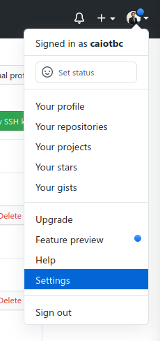
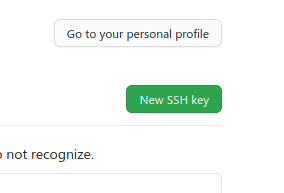

Tutoriais
*****************
    
Git
===================
O primeiro passo para trabalhar no sistema supervisório é obter o código. É possível baixar como um .zip no github
da equipe, porém isso torna difícil o controle de versionamento e a organização entre os membros. Assim, a melhor maneira é instalar
o git no PC e fazer um clone do seu fork do repositório.

Instalando o git
----------------

Linux
+++++++++++++++++++
O jeito mais rápido de instalar o git é utilizando o gerenciador de pacotes da sua distribuição. Em sistemas baseados em debian (Ubuntu/Pop OS/Mint/Raspberry PI OS), basta
executar como superusuário:

.. code-block:: bash
  :linenos:

  sudo apt update && sudo apt install git

Windows
+++++++++++++++++++

Para instalar o git no Windows, siga as instruções no site oficial: https://git-scm.com/

Criando um fork
----------------

Após criar uma conta no github, acesse a página do supervisório do cheetah: https://github.com/TelemetriaCheetah/Supervisorio
Em seguida, basta clicar no botão de fork

.. image:: images/print1.png
  :align: center

.. note::
  O fork é uma cópia do repositório vinculada à sua conta de usuário, e é nele que as modificações devem ser feitas. Alterar o código utilizando
  a conta do cheetah diretamente é uma prática que deve ser evitada ao máximo, pois impossibilita o controle do responsável por cada modificação.

Criando chaves SSH
----------------------

Para enviar seu código ao github, é necessário se autenticar no site. A autenticação por usuário/senha está sendo desativada aos poucos, e deixará de
funcionar em breve (Se você está lendo isto no futuro, é provável que já tenha sido desativada). Portanto, é necessário utilizar outro método de autenticação,
e uma maneira simples de fazer isso é adicionando chaves SSH à sua conta do github. Para gerar um par de chaves pública/privada, abra o terminal / powershell e
execute o comando:

.. code-block:: bash
  :linenos:

  ssh-keygen

O par de chaves gerado é salvo por padrão na sua pasta de usuário dentro de .ssh . Dentro da pasta, abra o arquivo de chave pública (o que termina com .pub) e copie seu conteúdo. Em seguida, vá até a sua
página do github e siga os passos:

.. note::

  Caso a pasta esteja oculta, vocẽ deve habilitar a opção de visualizar arquivos
  ocultos no seu gerenciador de arquivos.

Abra as configurações da contas

Vá até a opção de chaves SSH e GPG

.. image:: images/print3.png
  :align: center

Clique em adicionar nova chave SSH

Dê um título de sua preferência e cole a chave pública copiada no campo key

.. image:: images/print5.png
  :align: center

Clonando o repositório
------------------------

Para criar uma cópia local do seu repositório, copie o link no botão "code", lembrando que é necessário selecionar a opção "SSH":

.. image:: images/print6.png
  :align: center

Em seguida, abra o terminal / git shell (o git shell pode ser aberto clicando com o botão direito do mouse em um espaço branco dentro de uma pasta qualquer do Windows) e execute o comando:

.. code-block:: bash
  :linenos:

  git clone <cole o link que você copiou aqui>

Git Commit
-------------

Após realizar as alterações no código local, é necessário enviá-las ao repositório remoto (github). Para isso, abra o terminal / git shell dentro da pasta clonada e execute os comandos:

.. code-block:: bash
  :linenos:

  git add -A
  git commit -m "Escreva aqui uma mensagem breve explicando as alterações realizadas desde o último commit"
  git push origin main

Caso queira ver quais alterações fazem parte ou não do commit, use o comando

.. code-block:: bash
  :linenos:

  git status

Atualizando o repositório
------------------------------

Para garantir que você está trabalhando na versão mais recente do código, é necessário sincronizar o seu fork com o repositório original (comumente chamado de upstream). Para isso,
adicione o repositório original no seu git:

.. code-block:: bash
  :linenos:

  git remote add upstream <link para repositório do cheetah>
  git fetch upstream

Feito isso, você deve executar o comando abaixo toda vez que alguma alteração for realizada por outra pessoa no repositório do Cheetah:

.. code-block:: bash
  :linenos:

  git pull upstream main

Criando um pull request
--------------------------

Finalmente, para submeter suas alterações para o repositório upstream, basta criar um pull request clicando em "pull requests" e em seguida "criar novo pull request".
O request deve ser aprovado pelo mantenedor do repositório oficial do Cheetah.

Instalando o node
=====================

A tecnologia principal utilizada para o backend do sistema supervisório é o node.js:

Linux
------

Em sistemas baseados em debian (Ubuntu/Pop OS/Mint/Raspberry PI OS), basta
executar como superusuário:
sudo apt update && sudo apt install nodejs

Windows
---------

Para instalar o node no Windows, siga as instruções no site oficial: https://nodejs.org/en/download/

Instalando o MySQL
=====================

Linux
--------
Em sistemas baseados em debian (Ubuntu/Pop OS/Mint/Raspberry PI OS), basta
executar como superusuário:

sudo apt update && sudo apt install apache2 mariadb-server phpmyadmin

Windows
-------------

No Windows, é possível baixar pacotes que incluem todas as ferramentas necessárias para rodar um servidor apache com MySQL/MariaDB e php
em um único executável. Um exemplo recomendado é o WAMP (Windows Apache MySQL PHP) server, que pode ser baixado no link: https://www.wampserver.com/en/

Tutoriais de programação
====================================

O sistema supervisório é escrito utilizando javascript para o frontend e backend, portanto javascript é a linguagem que deve ser o foco dos estudos. Para
a formatação do site são utilizados HTML5 e CSS, e portanto é necessário possuir conhecimento dessas linguagens também. Além disso,
os dados coletados são armazenados em um banco de dados MySQL, e familiaridade com queries SQL é bastante útil. Seguem abaixo alguns links relevantes sobre os assuntos:

* https://www.urionlinejudge.com.br URI Online Judge - para treinar algoritmos e básico de programação
* https://developer.mozilla.org/pt-BR/docs/Learn/Getting_started_with_the_web/JavaScript_basics JavaScript básico - documentação da Mozilla
* https://www.youtube.com/watch?v=vrSEt5J4q2Y&list=PLbA-jMwv0cuWbas947cygrzfzHIc7esmp Curso javascript básico - youtube
* https://www.youtube.com/watch?v=CjQMi8mv2Do Introdução ao node.js - youtube
* https://www.youtube.com/watch?v=BhJu05tUo-M Introdução ao MySQL - youtube
* https://www.youtube.com/watch?v=Em0R3csNMVE&list=PLhkO7OMKgT_p3VoB47VHdLGpYTzxYTv8R Introdução HTML5 e CSS - youtube
